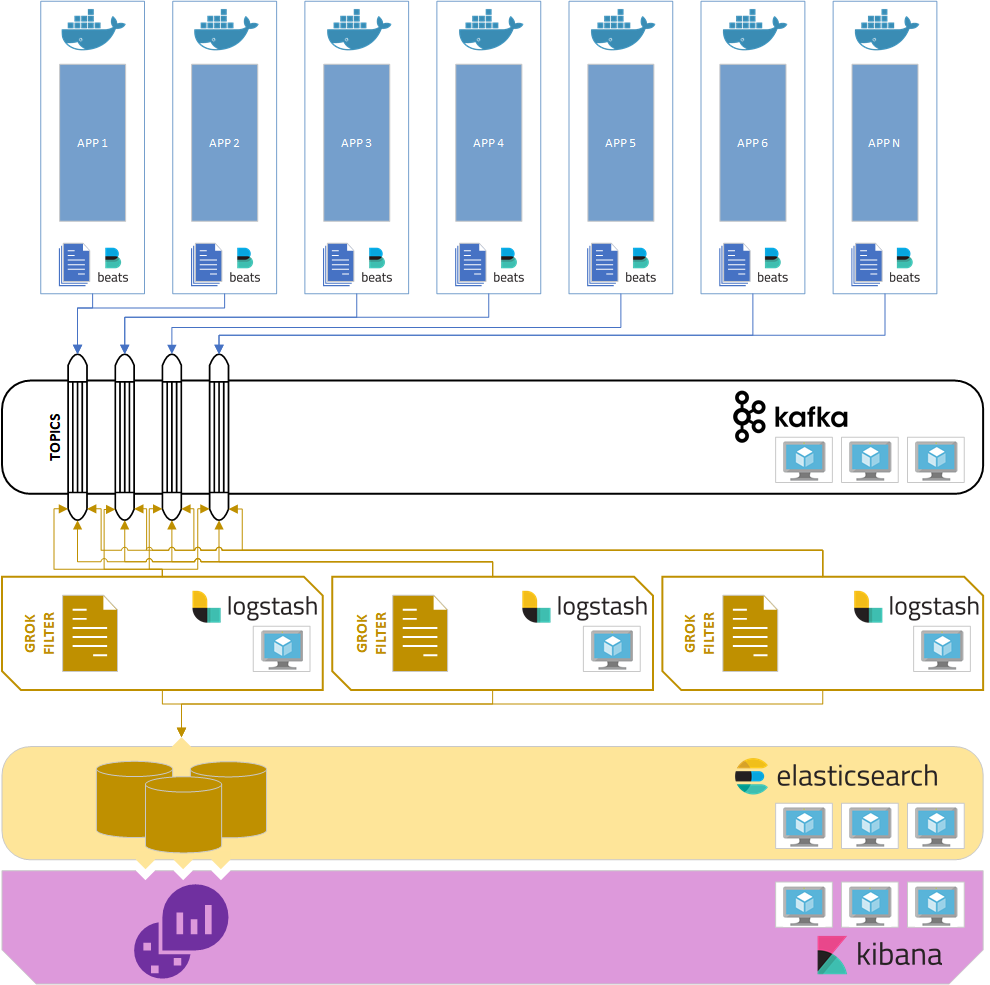
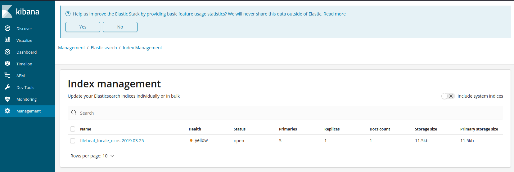

# Dev Environment for ELK Stack

The goal is to reproduce a development environment for logging and monitoring stack with the logical architecture of production environment. 



Docker Compose runs the version 6.4 of the ELK stack (Elasticsearch, Logstash, Kibana) behind an Apache Kafka streaming platform that provide the applications logging messages.

Based on the official Docker images of :

* elasticsearch
* filebeat
* kibana
* logstash
* kafka
* zookeper

## Requirements 

### Host setup
* Install Docker version 18.09.2+
* Install Docker Compose version 1.17.1+
* Clone this repository


## Usage

### Bringing up the stack

Start the ELK stack using docker-compose:

```sh
$ docker-compose -f docker-compose-elk.yml up
```

You can also choose to run it in background (detached mode):

```sh
$ docker-compose -f docker-compose-elk.yml up -d
```

Give Kibana a few seconds to initialize, then access the Kibana web UI by hitting http://localhost:5601 with a web browser.

### Try that everything works

You can copy a sample log file present in directory `./filebeat/sample_logs` to the `./filebeat/logs_scanned_directory` :

```sh
$ cp ./filebeat/sample_logs/sample.log ./filebeat/logs_scanned_directory
```

In few second you can see logs like this :

```
filebeat_1       | 2019-03-25T15:42:43.236Z	INFO	log/harvester.go:251	Harvester started for file: /usr/share/filebeat/logs/sample.log
filebeat_1       | 2019-03-25T15:42:49.239Z	INFO	kafka/log.go:53	kafka message: Initializing new client
filebeat_1       | 2019-03-25T15:42:49.240Z	INFO	kafka/log.go:53	client/metadata fetching metadata for all topics from broker kafka1:9092
filebeat_1       | 2019-03-25T15:42:49.242Z	INFO	kafka/log.go:53	Connected to broker at kafka1:9092 (unregistered)
filebeat_1       | 2019-03-25T15:42:49.243Z	INFO	kafka/log.go:53	client/brokers registered new broker #1 at kafka1:9092
filebeat_1       | 2019-03-25T15:42:49.243Z	INFO	kafka/log.go:53	kafka message: Successfully initialized new client
filebeat_1       | 2019-03-25T15:42:49.243Z	INFO	kafka/log.go:53	producer/broker/1 starting up
filebeat_1       | 2019-03-25T15:42:49.243Z	INFO	kafka/log.go:53	producer/broker/1 state change to [open] on filebeat_locale_dcos/0
filebeat_1       | 2019-03-25T15:42:49.243Z	INFO	kafka/log.go:53	Connected to broker at kafka1:9092 (registered as #1)
logstash_1       | /usr/share/logstash/vendor/bundle/jruby/2.3.0/gems/jls-grok-0.11.5/lib/grok-pure.rb:182: warning: character class has '-' without escape
logstash_1       | /usr/share/logstash/vendor/bundle/jruby/2.3.0/gems/jls-grok-0.11.5/lib/grok-pure.rb:182: warning: character class has '-' without escape
logstash_1       | /usr/share/logstash/vendor/bundle/jruby/2.3.0/gems/jls-grok-0.11.5/lib/grok-pure.rb:182: warning: character class has '-' without escape
logstash_1       | /usr/share/logstash/vendor/bundle/jruby/2.3.0/gems/jls-grok-0.11.5/lib/grok-pure.rb:182: warning: character class has '-' without escape
logstash_1       | [2019-03-25T15:42:49,595][WARN ][org.logstash.FieldReference] Detected ambiguous Field Reference `message[0]`, which we expanded to the path `[message, 0]`; in a future release of Logstash, ambiguous Field References will not be expanded.
elasticsearch_1  | [2019-03-25T15:42:49,729][WARN ][o.e.d.c.m.MetaDataCreateIndexService] the default number of shards will change from [5] to [1] in 7.0.0; if you wish to continue using the default of [5] shards, you must manage this on the create index request or with an index template
elasticsearch_1  | [2019-03-25T15:42:49,737][INFO ][o.e.c.m.MetaDataCreateIndexService] [JyU5IHT] [filebeat_locale_dcos-2019.03.25] creating index, cause [auto(bulk api)], templates [], shards [5]/[1], mappings []
elasticsearch_1  | [2019-03-25T15:42:50,158][INFO ][o.e.c.m.MetaDataMappingService] [JyU5IHT] [filebeat_locale_dcos-2019.03.25/_Md3q6D5QwyO9E91U3tdQQ] create_mapping [doc]
```

then a new index on Kibana:




## Improvements

* Integrate with the log of a real application.
* Add APM Server Module.